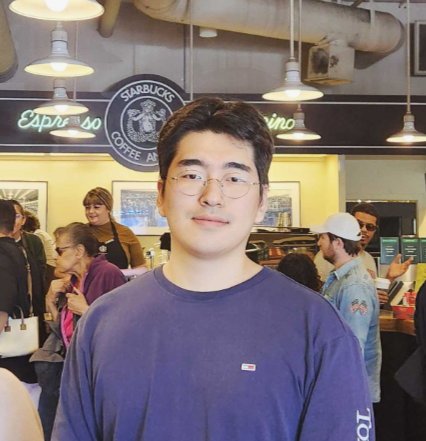

## About Me

<a href="https://hpcp.yonsei.ac.kr/">HPCP Lab</a> @ Yonsei University 
  Advisor: <a href="https://hpcp.yonsei.ac.kr/~youngsok/">Prof. Youngsok Kim</a> 
  cmlim@yonsei.ac.kr 
  

Hi! I am Chaemin Lim, currently a Ph.D student in the Department of Artificial Intelligence at Yonsei University with my advisor Prof. Youngsok Kim.

## Research Interest

* Database/Operating Systems on Modern Hardwares
* Hardware/Software Co-optimization
* Concurrent Computing
* Heterogeneous Computing
 
## Publications

1. <b><a href="https://doi.org/10.1145/3589258">Design and Analysis of a Processing-in-DIMM Join Algorithm: A Case Study with UPMEM DIMMs</a></b> <a href="https://github.com/yonsei-hpcp/pid-join">[GitHub]</a> 
<b>Chaemin Lim</b>, Suhyun Lee, Jinwoo Choi, Jounghoo Lee, Seongyeon Park, Hanjun Kim, Jinho Lee, and Youngsok Kim 
<i>2023 ACM SIGMOD International Conference on Management of Data (<b>SIGMOD</b>)</i>, June 2023

2. <b><a href="https://dl.acm.org/doi/10.1145/3528535.3531513">GuardiaNN: Fast and Secure On-Device Inference in TrustZone Using Embedded SRAM and Cryptographic Hardware</a></b> 
Jinwoo Choi<small>1</small>, Jaeyeon Kim<small>1</small>, <b>Chaemin Lim<small>1</small></b>, Suhyun Lee, Jinho Lee, Dokyung Song, and Youngsok Kim 
<i>23rd ACM/IFIP International Middleware Conference (<b>Middleware</b>)</i>, Nov. 2022  
<small>1Co-first authors</small> 

## Invited Talks

1. <b>A Fast Processing-in-DIMM Join Algorithm Exploiting UPMEM DIMMs</b> @ <a href="https://www.upmem.com/abumpimp-2023/">ABUMPIMP</a>, EUROPAR 2023

## Projects

1. <b>Development of New Concept PIM Semiconductor Leading Technology</b>
<i>Institute for Information and communication Technology Planning and evaluation (IITP)</i>

2. <b>STACK: Smart, Attack-Resistant Internet of Things Networks</b>
<i>Korea Institute for Advancement of Technology (KIAT)</i>

## Education

* [2023 - Current] PhD Student at the Department of Computer Science at Yonsei University
* [2021 - 2023] MSc in Artificial Intelligence at Yonsei University
* [2017 - 2021] BEng in Computer Engineering at Hankuk University of Foreign Studies (Double Major)
* [2017 - 2021] BA in Journalism at Hankuk University of Foreign Studies
